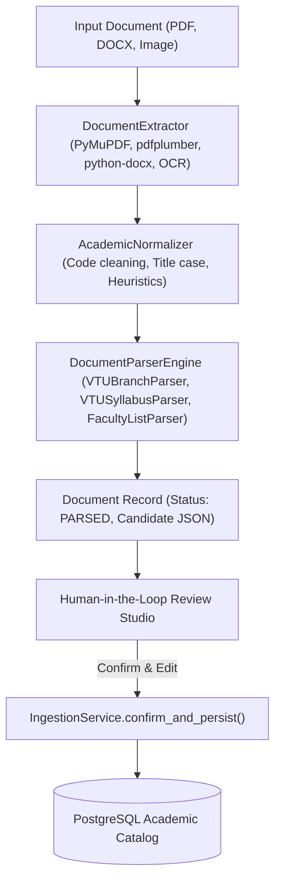

# Academic Curriculum & Document Ingestion Pipeline

**Author:** Ujwal (Branch: `ujwal`)  
**Domain:** Academic Data, Document Ingestion, First-Year Streams, Cycle Groups, Subject Management, Faculty Directory

---

## 1. Overview & Architecture

The Academic Pipeline is responsible for creating and maintaining reliable academic data for Chronon without hardcoding college schemes:

---

## 2. First-Year Streams & Physics/Chemistry Cycle Groups

In VTU and autonomous engineering colleges, first-year curriculum is unified across branches via **Streams** and mirrored **Cycle Groups**:

1. **Streams**: Parent groupings of branches.
   - Example: *CSE Stream* groups CSE, ISE, AIML, AIDS.
   - Example: *Mechanical Stream* groups ME, CV, etc.
2. **Student Rollup**:
   $$\text{Total Stream Students} = \sum_{b \in \text{Stream.branches}} \text{Branch.student\_count}$$
3. **Cycle Group Division**:
   - **Physics Group**: Sem 1 $\rightarrow$ Physics Cycle, Sem 2 $\rightarrow$ Chemistry Cycle.
   - **Chemistry Group**: Sem 1 $\rightarrow$ Chemistry Cycle, Sem 2 $\rightarrow$ Physics Cycle.
4. **Split Methods**:
   - `EVEN`: Half split $\lceil N/2 \rceil$ Physics, $\lfloor N/2 \rfloor$ Chemistry.
   - `MANUAL`: User-specified counts.
   - `CAPACITY`: Aligned with physical laboratory workstation capacity.
5. **Common Subjects Representation**:
   - Common subjects (e.g. `22MATS11` Maths, `22ENG16` English) have `cycle_group = NULL` to avoid duplicating subject records.
   - Cycle-specific subjects have `cycle_group = "PHYSICS"` or `"CHEMISTRY"`.

---

## 3. Human-in-the-Loop Document Ingestion

1. **Extraction**:
   - Uses PyMuPDF and pdfplumber for digital PDF course schedules.
   - Uses python-docx for faculty rosters and syllabus documents.
   - Uses Tesseract with image pre-processing (grayscale, sharpening, contrast) for scanned files.
2. **Normalization & Parsing**:
   - Regular expression pattern matchers extract standard codes (`21CS32`, `22MATS11`, `21CSL35`).
   - Normalizes faculty honorific titles (`Dr.`, `Prof.`) and detects departmental specializations.
3. **Review & Confirmation**:
   - Extracted candidate cards are presented in the Ingestion Studio.
   - The user reviews, edits confidence scores, and clicks **Confirm & Commit** to atomically persist entities into the official catalog.
