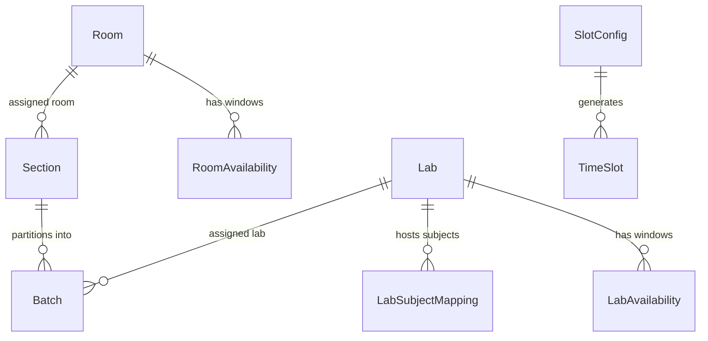

# Physical Resources, Sectioning & Timetable Presentation Architecture

**Domain Owner:** Nivish (`nivish` branch)  
**Monorepo Component:** Physical Resources, Deterministic Mathematical Utilities, Time Slots, Matrix Grid Presentation  

---

## 1. Domain Responsibility & Boundary

Nivish is strictly responsible for:
1. **Physical Resource Catalog**:
   - Classrooms (`Room`): Seating capacities, buildings, room types, availability windows.
   - Physical Laboratories (`Lab`): Workstation counts per room, parallel instance counts, discipline types, availability windows.
2. **Academic Lab ⟷ Physical Resource Mapping (`LabSubjectMapping`)**:
   - Decouples academic syllabus lab subjects (e.g., *Data Structures Lab*, *Operating Systems Lab*, *IDEA Lab*) from physical hardware spaces (e.g., *CS Lab 1* with 30 workstations).
   - Guarantees shared-hardware conflict prevention across academic subjects.
3. **Deterministic Calculation Services (`resource_calc.py`)**:
   - Section sizing: $\lceil \text{student\_count} / \text{room\_capacity} \rceil$.
   - Batch partitioning: $\lceil \text{section\_students} / \text{lab\_capacity} \rceil$.
   - Batch student sum invariant: $\sum \text{batch\_counts} = \text{section\_students}$.
   - Master Time Slot schedule generation with configurable durations, breaks, and non-teaching blocks.
4. **Timetable Presentation Service (`timetable_view.py`)**:
   - Assembles stored sessions into a 2D matrix (Days $\times$ Periods).
   - Multi-perspective views: Section, Faculty, Classroom, Physical Lab, Batch, and 1st-Year Cycle.
   - Paired-slot visual group aggregation (`P1`, `P2`, `P3`).
   - Conflict diagnostic overlay.
   - CSV and JSON report exports without invoking the solver.

---

## 2. Mathematical Models & Invariants

### 2.1 Section Division
For total enrolled students $N$ in a branch/semester and classroom seating capacity $C_{\text{room}}$:
$$\text{Sections Count} = \left\lceil \frac{N}{C_{\text{room}}} \right\rceil$$

- When $N = 0$, $\text{Sections Count} = 0$.
- Under **Balanced Distribution**, each section $i \in \{0, \dots, S-1\}$ receives:
  $$n_i = \left\lfloor \frac{N}{S} \right\rfloor + [i < (N \pmod S)]$$
- Strict Invariant: $\sum_{i=0}^{S-1} n_i = N$.

### 2.2 Lab Batch Partitioning
For a section with $n$ students and a physical laboratory with workstation capacity $C_{\text{lab}}$:
$$\text{Batches Count} = \left\lceil \frac{n}{C_{\text{lab}}} \right\rceil$$

- Each batch $j \in \{0, \dots, B-1\}$ is allocated students $\le C_{\text{lab}}$.
- Strict Invariant: $\sum_{j=0}^{B-1} \text{batch\_students}_j = n$.

### 2.3 First-Year Cycle Joint Scheduling
Sections in the 1st year are tagged with `cycle_group` (`PHYSICS_CYCLE` or `CHEMISTRY_CYCLE`). Paired sessions sharing identical time slot windows are assigned a `paired_slot_group` identifier (e.g., `P1`), allowing the solver and grid view to visualize parallel mirrored streams without room or faculty clashes.

---

## 3. Database Schema

### Models Summary:
- `Room`: `id`, `institution_id`, `name`, `building`, `capacity`, `room_type`, `is_active`.
- `RoomAvailability`: `id`, `room_id`, `day_of_week`, `start_time`, `end_time`, `is_available`.
- `Lab`: `id`, `institution_id`, `name`, `building`, `capacity`, `count`, `lab_type`.
- `LabAvailability`: `id`, `lab_id`, `day_of_week`, `start_time`, `end_time`, `is_available`.
- `LabSubjectMapping`: `id`, `subject_id`, `lab_id`.
- `Section`: `id`, `branch_id`, `semester_id`, `name`, `student_count`, `room_id`, `stream_id`, `cycle_group`, `is_override`.
- `Batch`: `id`, `section_id`, `name`, `student_count`, `lab_id`.
- `SlotConfig`: `id`, `institution_id`, `name`, `theory_duration_minutes`, `lab_duration_minutes`, `working_days`, `day_start_time`, `day_end_time`, `breaks`, `lunch_break`, `non_teaching_periods`.
- `TimeSlot`: `id`, `day_of_week`, `period_index`, `start_time`, `end_time`, `slot_type`, `label`.

---

## 4. Frontend Architecture

- **Resource Hub** (`/resources`):
  - `RoomManager.tsx`: Classroom inventory & capacities.
  - `LabManager.tsx`: Physical lab workstations & count instances.
  - `LabSubjectMappingCard.tsx`: Visual diagram mapping academic lab subjects to hardware.
  - `SectionCalculator.tsx`: Pure section sizing calculator with override controls.
  - `BatchCalculator.tsx`: Pure batch partitioning with invariant validation.
  - `TimeSlotConfigurator.tsx`: Master schedule timeline and slot generator.
- **Timetable Matrix Grid** (`/timetables`):
  - `TimetableMatrixGrid.tsx`: 2D table (Days $\times$ Periods), Section/Faculty/Room/Lab/1st-Year Cycle views, paired-slot cards, conflict badges, print stylesheet.
